# TerraWatch

**Global Real-Time Soil Health Monitoring & Natural Disaster Risk Analysis Platform**

[](https://python.org)
[](https://fastapi.tiangolo.com)
[](https://react.dev)
[](https://typescriptlang.org)
[](https://vitejs.dev)
[](https://tailwindcss.com)
[](LICENSE)

TerraWatch is a full-stack geospatial platform that combines soil health analysis with multi-hazard disaster risk assessment. Click any point on the globe to get soil quality scores, erosion estimates, landslide/flood/wildfire/liquefaction risk levels, crop recommendations, and emergency preparedness plans — all computed from live data pulled from USGS, Open-Meteo, and ISRIC SoilGrids. No API keys needed.

> **Live Demo:** [huggingface.co/spaces/teaphile/terrawatch](https://huggingface.co/spaces/teaphile/terrawatch)

---

## Table of Contents

- [Features](#features)
- [Architecture](#architecture)
- [Tech Stack](#tech-stack)
- [Getting Started](#getting-started)
- [Docker Deployment](#docker-deployment)
- [API Reference](#api-reference)
- [Frontend Components](#frontend-components)
- [Analytical Models](#analytical-models)
- [Data Sources](#data-sources)
- [Environment Variables](#environment-variables)
- [Project Structure](#project-structure)
- [Testing](#testing)
- [License](#license)

---

## Features

### Soil Health Analysis

- **Soil property prediction** — pH, organic carbon (g/kg), nitrogen (mg/kg), texture class (USDA textural triangle), cation exchange capacity (CEC), bulk density (g/cm³), and volumetric moisture content at multiple depths.
- **Health index scoring** — Composite score from 0 to 100 derived from weighted soil parameters. Grades: A (80–100), B+ (65–79), B (50–64), C (35–49), D (< 35). Each parameter (pH, organic carbon, nitrogen, moisture, CEC, bulk density) is normalized on optimal agronomic ranges before aggregation.
- **RUSLE erosion modeling** — Full implementation of the Revised Universal Soil Loss Equation: `A = R × K × LS × C × P`. Computes rainfall erosivity (R), soil erodibility (K, based on texture/organic content), slope length-steepness (LS), cover management (C, derived from NDVI/land cover), and support practice (P). Outputs annual soil loss in tons/ha/yr with five risk tiers (Very Low through Very High).
- **Carbon sequestration estimates** — Current organic carbon stock (tons/ha), maximum sequestration potential based on soil type/climate zone, and estimated improvement rate (tons/ha/yr) under recommended management practices.
- **Multi-depth soil moisture** — Volumetric water content at 0–1 cm, 1–3 cm, 3–9 cm, 9–27 cm, and 27–81 cm depths from Open-Meteo's soil moisture model.

### Disaster Risk Assessment

- **Landslide susceptibility** — 10-factor weighted model incorporating slope angle, soil saturation, clay content, seismic activity, rainfall intensity, land cover, drainage density, soil depth, previous event history, and proximity to fault lines. Regional adjustments applied for known geological zones. Output: susceptibility class (Low/Moderate/High/Very High/Critical) with a 0–1 probability score.
- **Flood risk** — Analyzes terrain elevation relative to nearest water body, slope gradient, soil infiltration capacity (based on texture), cumulative rainfall in last 24/48/72 hours, upstream drainage area, and land cover imperviousness. Provides return period estimate, expected inundation depth (meters), and risk level.
- **Wildfire risk** — Fuel moisture deficit from temperature, humidity and wind speed. Factors in vegetation dryness index (NDVI-derived), drought conditions, historical fire frequency, and Fosberg Fire Weather Index. Outputs risk level with estimated spread potential (low/moderate/rapid/extreme).
- **Liquefaction potential** — Evaluates susceptibility based on soil grain size distribution, groundwater depth, sand/silt layer presence, and seismic demand (PGA from recent earthquakes). Includes probability of occurrence given a M7.0 event at various distances.
- **Composite risk score** — Combined multi-hazard score computed as `0.6 × max(individual_risks) + 0.4 × mean(individual_risks)`. Prevents masking of a single extreme hazard while still reflecting overall exposure. Mapped to five levels: Low, Moderate, High, Very High, Critical.

### Interactive Map

- **Dark/light basemaps** — CARTO Dark Matter (default) and CARTO Voyager (light) tile layers, plus terrain overlay toggle.
- **Real-time earthquake markers** — Circle markers with radius proportional to magnitude and color coded by significance (green → yellow → orange → red → darkred). Pulse-glow animation on new events.
- **Click-to-analyze** — Click any point on the map to kick off soil analysis + risk assessment for those coordinates. Results stream into the sidebar panels.
- **Animated fly-to** — When coordinates are entered via the header search bar, the map smoothly pans and zooms to the location.
- **Layer controls** — Toggle visibility for earthquakes, soil health overlay, risk zones, and terrain. Each layer has a legend color chip.
- **Dynamic legend** — Shows earthquake magnitude scale, risk level colors, and soil health grading scale. Includes a soil health section (Good 70+ / Fair 50–70 / Poor < 50).
- **Responsive controls** — Map controls reposition for mobile (zoom bottom-left, layers top-right). Coordinate chip shown on mobile at bottom center.

### Real-Time Data Pipeline

- **USGS earthquake feed** — Background task fetches M2.5+ events from the USGS FDSN API every `EARTHQUAKE_FETCH_INTERVAL` seconds (default 300, configurable). Events displayed as soon as they arrive.
- **WebSocket alert stream** — Backend monitors incoming earthquake data and pushes alerts for M4.0+ events over a WebSocket connection at `/ws/alerts`. Frontend receives them instantly and appends to the alert feed.
- **Open-Meteo integration** — Current weather conditions (temperature, humidity, precipitation, wind), climate normals (30-year averages by month), and soil moisture profiles. Data cached with configurable TTL.
- **ISRIC SoilGrids** — Soil property data (pH, organic carbon, CEC, texture fractions, bulk density, nitrogen) at queried coordinates. Queried at 0–5 cm, 5–15 cm, 15–30 cm depths.

### Weather Dashboard

- Full weather panel showing current conditions with WMO weather code icons, six primary metrics (temperature, humidity, precipitation, rain, wind speed, wind direction), climate averages for the current month, and charts for weather conditions + environmental radar.

### Smart Recommendations

- **Crop suitability** — 12-crop database (wheat, rice, maize, soybean, cotton, potato, tomato, sugarcane, coffee, tea, barley, millet) each scored against soil pH range, organic carbon, nitrogen, moisture, and texture suitability. Outputs a 0–100 suitability score per crop.
- **Fertilizer guidance** — Nutrient status assessment (nitrogen, phosphorus, potassium) classified as deficient/adequate/high, with specific application rates (kg/ha) for conventional fertilizers and organic alternatives (compost, manure, bone meal, etc.).
- **Irrigation scheduling** — Computes available water holding capacity from soil texture and organic content. Recommends irrigation method (drip, sprinkler, furrow, flood), frequency (days), depth per application (mm), and urgency level.
- **Disaster preparedness** — Location-specific emergency plans based on active risk levels. Includes evacuation zone recommendations, structural reinforcement priorities, early warning system suggestions, and emergency supply checklists.
- **Environmental restoration** — Suggests native plant species for erosion control based on climate zone, carbon improvement strategies (cover cropping, no-till, biochar application), and wetland/riparian buffer recommendations.

### Data Export

- **CSV** — Soil analysis results in spreadsheet-compatible format with all properties, scores, and metadata.
- **GeoJSON** — Soil and risk data formatted for direct import into QGIS, ArcGIS, or any GIS platform. Includes point geometry with properties.
- **Full JSON Report** — Comprehensive export with soil analysis, risk assessment, weather data, recommendations, and metadata in a single structured document.

### Responsive Design

- **Mobile** — Bottom navigation bar with slide-up drawer for sidebar content. Touch-friendly tap targets (min 44px). Map controls repositioned. Search overlay.
- **Tablet** — Side panel with adaptive width. Scrollable content areas.
- **Desktop** — Full sidebar, overlay panels, and keyboard shortcuts. Focus-visible rings on all interactive elements.
- **Print styles** — Clean output with hidden navigation elements.

---

## Architecture

```mermaid
graph TB
    subgraph Client["Browser"]
        UI["React 18 SPA<br/>(TypeScript + Vite)"]
        Map["Leaflet Map"]
        Charts["Recharts<br/>17 chart components"]
        WS_Client["WebSocket Client"]
    end

    subgraph Server["FastAPI Backend"]
        API["REST API<br/>/api/v1/*"]
        WS_Server["WebSocket<br/>/ws/alerts"]
        MW["Middleware<br/>CORS · Rate Limit · Auth"]
        Services["Service Layer<br/>soil · disaster · weather<br/>recommendation · alert · cache<br/>gis · satellite"]
        Models["Analytical Models<br/>erosion · landslide · flood<br/>fire · liquefaction · soil"]
        BG["Background Tasks<br/>earthquake fetch · alert generation"]
    end

    subgraph Data["Data Layer"]
        Cache["In-Memory TTL Cache<br/>(cachetools)"]
        DB[(SQLite<br/>aiosqlite)]
    end

    subgraph External["External APIs (no auth)"]
        USGS["USGS Earthquake<br/>earthquake.usgs.gov"]
        OM["Open-Meteo<br/>api.open-meteo.com"]
        ISRIC["ISRIC SoilGrids<br/>rest.isric.org"]
    end

    UI -->|HTTP| API
    WS_Client -->|WebSocket| WS_Server
    API --> MW --> Services
    Services --> Models
    Services --> Cache
    Services --> DB
    BG --> Services
    Services -->|httpx async| USGS
    Services -->|httpx async| OM
    Services -->|httpx async| ISRIC
    WS_Server --> Services

    style Client fill:#1a1a2e,stroke:#30363d,color:#e6edf3
    style Server fill:#161b22,stroke:#30363d,color:#e6edf3
    style Data fill:#21262d,stroke:#30363d,color:#e6edf3
    style External fill:#161b22,stroke:#30363d,color:#e6edf3
```



**Request flow for a map click:**

1. User clicks a location on the Leaflet map → browser sends `GET /api/v1/soil/analyze?lat=28.6&lon=77.2` and `GET /api/v1/risk/all?lat=28.6&lon=77.2` in parallel.
2. Soil service checks TTL cache → on miss, fetches soil properties from ISRIC SoilGrids and weather/moisture from Open-Meteo concurrently via `httpx.AsyncClient`.
3. Raw data is processed through analytical models (erosion, health index, carbon sequestration).
4. Risk service queries recent seismic events (USGS), current weather (Open-Meteo), and soil conditions to compute landslide, flood, wildfire, and liquefaction probabilities.
5. Both responses are returned as JSON → React renders soil panel, risk summary, charts, and map overlays.

---

## Tech Stack

### Backend

| Component | Package | Version |
|-----------|---------|---------|
| Web framework | FastAPI | >= 0.110.0 |
| ASGI server | uvicorn | >= 0.27.0 |
| Validation | pydantic v2, pydantic-settings | >= 2.6.0, >= 2.1.0 |
| ORM | SQLAlchemy 2.0 (async) | >= 2.0.25 |
| Database driver | aiosqlite | >= 0.19.0 |
| HTTP client | httpx (async) | >= 0.26.0 |
| WebSocket | websockets | >= 12.0 |
| ML / Numerics | numpy, scikit-learn, joblib | >= 1.26, >= 1.4, >= 1.3 |
| Geospatial | geopy, shapely | >= 2.4, >= 2.0 |
| Caching | cachetools (in-memory TTL) | >= 5.3.0 |
| Serialization | orjson | >= 3.9.0 |
| Environment | python-dotenv | >= 1.0.0 |
| Runtime | Python 3.11+ (Docker: `python:3.11-slim`) | |

### Frontend

| Component | Package | Version |
|-----------|---------|---------|
| UI library | React | ^18.2.0 |
| Language | TypeScript | ^5.3.3 |
| Build tool | Vite | ^5.1.0 |
| Styling | Tailwind CSS | ^3.4.1 |
| Maps | leaflet + react-leaflet | ^1.9.4 / ^4.2.1 |
| Charts | Recharts | ^2.12.0 |
| Icons | lucide-react | ^0.344.0 |
| PostCSS | autoprefixer, postcss | ^10.4.17, ^8.4.35 |
| Runtime | Node.js 20 (Docker: `node:20-alpine`) | |

---

## Getting Started

### Prerequisites

- Python 3.11 or newer
- Node.js 18+ and npm
- Git

### 1. Clone the repository

```bash
git clone https://github.com/damnaum/two.git
cd two/terrawatch
```

### 2. Start the backend

```bash
cd backend

# Create and activate a virtual environment
python -m venv venv
source venv/bin/activate        # Linux / macOS
# venv\Scripts\activate         # Windows

# Install dependencies
pip install -r requirements.txt

# Start the server (with hot reload for development)
uvicorn app.main:app --reload --port 8000
```

The API is now running at `http://localhost:8000`. Interactive docs are at:
- Swagger UI: `http://localhost:8000/docs`
- ReDoc: `http://localhost:8000/redoc`

No `.env` file or API keys are required — the app works out of the box with free, keyless public APIs.

### 3. Start the frontend

```bash
cd frontend

# Install dependencies
npm install

# Start the Vite dev server
npm run dev
```

The frontend runs at `http://localhost:5173`. Vite is configured to proxy `/api` and `/ws` requests to `http://localhost:8000`, so both servers work together seamlessly.

### 4. Open in browser

Navigate to `http://localhost:5173`. Click anywhere on the map to analyze soil and disaster risk at that location.

---

## Docker Deployment

### docker-compose (self-hosting)

```bash
cd terrawatch
docker compose up --build
```

This starts two containers on your local machine:

| Service | Port | Description |
|---------|------|-------------|
| `backend` | 8000 | FastAPI API server with health checks |
| `frontend` | 80 | nginx serving the built React SPA |

The backend uses a named Docker volume (`backend-data`) to persist the SQLite database across container restarts.

### Single-container build (Hugging Face Spaces)

The root `Dockerfile` creates a unified container that builds the React frontend, bundles it with the backend, and serves everything on a single port:

```bash
docker build -t terrawatch .
docker run -p 7860:7860 terrawatch
```

This is the configuration used for the [live demo](https://huggingface.co/spaces/teaphile/terrawatch). The container runs as a non-root user for security.

---

## API Reference

All endpoints are prefixed with `/api/v1`. Query parameters `lat` (latitude, -90 to 90) and `lon` (longitude, -180 to 180) are required for location-based endpoints.

### Soil Analysis

| Method | Endpoint | Parameters | Description |
|--------|----------|------------|-------------|
| GET | `/api/v1/soil/analyze` | `lat`, `lon` | Full soil analysis — properties, health index, erosion risk, carbon sequestration, moisture profile |
| GET | `/api/v1/soil/moisture` | `lat`, `lon` | Soil moisture data at multiple depths |

### Risk Assessment

| Method | Endpoint | Parameters | Description |
|--------|----------|------------|-------------|
| GET | `/api/v1/risk/all` | `lat`, `lon` | Complete multi-hazard risk assessment (landslide, flood, wildfire, liquefaction, composite) |
| GET | `/api/v1/risk/landslide` | `lat`, `lon` | Landslide susceptibility only |
| GET | `/api/v1/risk/flood` | `lat`, `lon` | Flood risk only |
| GET | `/api/v1/risk/earthquake/recent` | `days` (default 7) | Recent earthquake events from USGS |

### Recommendations

| Method | Endpoint | Parameters | Description |
|--------|----------|------------|-------------|
| GET | `/api/v1/recommendations/agriculture` | `lat`, `lon` | Crop suitability, fertilizer, irrigation scheduling, soil amendments |
| GET | `/api/v1/recommendations/disaster` | `lat`, `lon` | Location-specific disaster preparedness plans |
| GET | `/api/v1/recommendations/environmental` | `lat`, `lon` | Restoration strategies, native species, carbon improvement |

### Alerts

| Method | Endpoint | Parameters | Description |
|--------|----------|------------|-------------|
| GET | `/api/v1/alerts/active` | — | All currently active alerts |
| GET | `/api/v1/alerts/history` | — | Historical alert log |
| DELETE | `/api/v1/alerts/{alert_id}` | `alert_id` (path) | Dismiss or delete a specific alert |

### Data Export

| Method | Endpoint | Parameters | Description |
|--------|----------|------------|-------------|
| GET | `/api/v1/export/soil/csv` | `lat`, `lon` | Soil analysis as CSV download |
| GET | `/api/v1/export/soil/geojson` | `lat`, `lon` | Soil data as GeoJSON (for QGIS, ArcGIS) |
| GET | `/api/v1/export/risk/geojson` | `lat`, `lon` | Risk assessment as GeoJSON |
| GET | `/api/v1/export/report` | `lat`, `lon` | Full JSON report (soil + risk + weather + recommendations) |

### System

| Method | Endpoint | Description |
|--------|----------|-------------|
| GET | `/api/v1/info` | API status, version, and endpoint directory |
| GET | `/api/v1/health` | Health check (includes cache stats, alert counts, uptime) |
| GET | `/api/v1/timeseries/soil-moisture` | Historical soil moisture (`lat`, `lon`, `days` default 30) |
| POST | `/api/v1/area/analyze` | Analyze a polygon area (GeoJSON body with coordinates array) |

### WebSocket

| Protocol | Endpoint | Description |
|----------|----------|-------------|
| WS | `/ws/alerts` | Real-time alert stream. Pushes JSON alert objects for M4.0+ earthquakes and other triggered hazards. |

---

## Frontend Components

The React app is organized into four component groups:

### Map (`src/components/Map/`)

| Component | Responsibility |
|-----------|---------------|
| `MapView` | Main Leaflet map container. Dark/light tile layers, click-to-analyze handler, earthquake markers with magnitude-scaled sizing, risk overlay circles, animated fly-to on coordinate search, mobile coordinate chip. |
| `LayerControl` | Toggleable checkboxes for earthquakes, soil health, risk zones, and terrain layers. |
| `Legend` | Color-coded scales for earthquake magnitude, risk levels, and soil health grades. |

### Dashboard (`src/components/Dashboard/`)

| Component | Responsibility |
|-----------|---------------|
| `RiskSummary` | Overlay panel showing composite risk score, individual hazard levels, active alerts count, and current weather conditions. Desktop: fixed top-right with scrolling. Mobile: integrated in sidebar. |
| `AlertFeed` | Live-updating list of alerts from WebSocket stream. Shows severity badge, title, description, timestamp, and distance from selected location. |
| `EarthquakeList` | Paginated list of recent seismic events (up to 50) with magnitude, depth, location, time ago, and felt reports. Includes stats summary bar (total count, max magnitude, avg depth, felt events) and a toggle to switch between list view and charts view (magnitude distribution, depth vs magnitude scatter, timeline). |
| `Charts` | 17 chart components built with Recharts — see table below. |
| `WeatherDashboard` | Weather panel with WMO weather code icons, 6-metric grid, climate normals, and two integrated charts. |

#### Chart Components (17 total)

| Chart | Type | Data Visualized |
|-------|------|----------------|
| `SoilPropertyChart` | Bar | pH, organic carbon, nitrogen, CEC, bulk density |
| `MoistureDepthChart` | Area | Moisture content at 5 depths (0–81 cm) |
| `ErosionFactorChart` | Radar | RUSLE factors R, K, LS, C, P |
| `CarbonChart` | Composed (bar + line) | Current carbon stock vs potential, improvement rate |
| `HealthGaugeChart` | Radial bar | Soil health index (0–100) with grade label |
| `RiskComparisonChart` | Bar (horizontal) | Side-by-side comparison of all hazard risk levels |
| `FloodReturnChart` | Line | Flood probability vs return period |
| `RiskRadarChart` | Radar | All risk types on a single radar polygon |
| `SoilNutrientChart` | Bar (grouped) | NPK status — current level vs optimal range |
| `HealthBreakdownChart` | Pie | Contribution of each parameter to the health index |
| `EarthquakeMagDistChart` | Bar | Frequency distribution of earthquake magnitudes |
| `EarthquakeDepthMagChart` | Scatter | Depth vs magnitude scatter plot |
| `EarthquakeTimelineChart` | Line | Earthquake events over time |
| `WeatherConditionsChart` | Bar | Temperature, humidity, precipitation, wind speed |
| `CompositeRiskGauge` | Radial bar (dual) | Composite score + max individual risk |
| `SoilCompositionChart` | Pie | Sand, silt, clay percentages |
| `EnvironmentalRadarChart` | Radar | Multi-axis environmental conditions |

### Analysis (`src/components/Analysis/`)

| Component | Responsibility |
|-----------|---------------|
| `SoilAnalysis` | Full soil analysis panel — property table, health grade, erosion details, carbon sequestration, integrated charts. |
| `RiskAnalysis` | Risk assessment panel — individual hazard breakdowns with probabilities, contributing factors, and risk comparison charts. |
| `Recommendations` | Tabbed interface for agriculture (crops, fertilizer, irrigation), disaster preparedness, and environmental restoration recommendations. |
| `ExportPanel` | Download buttons for CSV, GeoJSON, and full JSON report. Shows preview of export data. |

### Common (`src/components/Common/`)

| Component | Responsibility |
|-----------|---------------|
| `Header` | App title, live UTC clock (1-second interval), coordinate search input (parses `lat, lon`), geolocation button (browser Geolocation API). |
| `Sidebar` | Desktop: slide-out panel. Mobile: bottom nav bar + slide-up drawer. Tabs: Dashboard, Soil, Risk, Recommendations, Earthquakes, Weather, Export. Fade-in transitions on content swap. |
| `Loading` | Spinner with contextual message. |
| `ErrorBoundary` | React error boundary with fallback UI and retry button. |

---

## Analytical Models

Located in `backend/app/models/`:

| Model | File | Method |
|-------|------|--------|
| **Soil Property Prediction** | `soil_model.py` | Combines ISRIC SoilGrids API data with terrain/climate corrections. Fills data gaps using pedotransfer functions based on texture class and organic content. |
| **RUSLE Erosion** | `erosion_model.py` | Computes `A = R × K × LS × C × P` where R is derived from annual precipitation pattern, K from soil texture triangle + organic carbon, LS from slope/length (Wischmeier & Smith), C from NDVI-derived cover, and P from land use/practice assumptions. |
| **Landslide Susceptibility** | `landslide_model.py` | Weighted linear combination of 10 factors with sigmoid transformation to 0–1 probability. Weights calibrated against landslide inventory data. Regional multipliers for Himalayan, Andean, Alpine, and Pacific Rim zones. |
| **Flood Risk** | `flood_model.py` | Multi-factor scoring: elevation deficit, slope, infiltration capacity (from soil texture), rainfall accumulation (24/48/72h), drainage area, imperviousness. Return period estimated via log-normal fit. |
| **Wildfire Risk** | `fire_model.py` | Fosberg Fire Weather Index for current conditions. Fuel moisture content from temperature/humidity. Vegetation dryness from NDVI. Historical fire frequency weighting. Spread potential from wind speed + slope + fuel connectivity. |
| **Liquefaction** | `liquefaction_model.py` | Susceptibility from grain size (sand/silt fraction), groundwater depth, and soil age. Probability given M7.0 event using Seed & Idriss (1971) simplified procedure adapted for available soil data. |

---

## Data Sources

All primary data sources are free and require no API keys or registration.

| Source | URL | Data Used | Update Frequency |
|--------|-----|-----------|-----------------|
| **USGS Earthquake Hazards** | `earthquake.usgs.gov/fdsnws/event/1` | Real-time seismic events (magnitude, location, depth, felt reports, tsunami flag) | Every 5 min (configurable) |
| **Open-Meteo** | `api.open-meteo.com/v1` | Current weather, hourly/daily forecasts, climate normals (1991–2020), soil temperature & moisture at 5 depths | Every 30 min (configurable) |
| **ISRIC SoilGrids** | `rest.isric.org/soilgrids/v2.0` | Soil properties at 250m resolution — pH (H2O), organic carbon, CEC, texture fractions (sand/silt/clay), bulk density, total nitrogen | On demand, cached 1 hour |
| **NASA FIRMS** | `firms.modaps.eosdis.nasa.gov` | Active fire/hotspot detection (referenced in architecture) | Optional integration |

Data is fetched via `httpx.AsyncClient` with connection pooling. Responses are cached in-memory using `cachetools.TTLCache` (default TTL: 1 hour, max entries: 1000) to minimize redundant API calls.

---

## Environment Variables

All configuration is managed via environment variables (loaded from `.env` file via pydantic-settings). The app runs with sensible defaults — no configuration is required for development.

| Variable | Default | Description |
|----------|---------|-------------|
| `APP_NAME` | `TerraWatch` | Application name (shown in API info) |
| `APP_VERSION` | `1.0.0` | Version string |
| `DEBUG` | `False` | Enable debug mode (verbose logging, auto-reload) |
| `LOG_LEVEL` | `INFO` | Log level: DEBUG, INFO, WARNING, ERROR |
| `HOST` | `0.0.0.0` | Server bind address |
| `PORT` | `8000` | Server bind port (overridden to 7860 on HF Spaces) |
| `DATABASE_URL` | `sqlite+aiosqlite:///./terrawatch.db` | Async database connection string |
| `CORS_ORIGINS` | `localhost:3000, localhost:5173, *.hf.space` | Comma-separated allowed origins |
| `API_SECRET_KEY` | _(auto-generated)_ | Secret key for optional auth middleware |
| `OPENWEATHER_API_KEY` | _(empty)_ | Optional OpenWeatherMap key (fallback source) |
| `MAPBOX_TOKEN` | _(empty)_ | Optional Mapbox token (not used by default) |
| `OPEN_METEO_ENABLED` | `True` | Enable Open-Meteo weather integration |
| `USGS_API_ENABLED` | `True` | Enable USGS earthquake background feed |
| `CACHE_TTL_SECONDS` | `3600` | Cache entry time-to-live (seconds) |
| `CACHE_MAX_SIZE` | `1000` | Maximum cache entries before eviction |
| `RATE_LIMIT_PER_MINUTE` | `100` | API rate limit per client IP |
| `EARTHQUAKE_FETCH_INTERVAL` | `300` | Seconds between earthquake data fetches |
| `WEATHER_FETCH_INTERVAL` | `1800` | Seconds between weather data refreshes |
| `SATELLITE_FETCH_INTERVAL` | `21600` | Seconds between satellite data checks |

---

## Project Structure

```
terrawatch/
├── backend/
│   ├── app/
│   │   ├── main.py                    # FastAPI entry point, router registration, lifespan events
│   │   ├── config.py                  # Pydantic settings (env var loading)
│   │   ├── database.py                # SQLAlchemy async engine, session factory, models
│   │   ├── api/
│   │   │   ├── routes/
│   │   │   │   ├── soil.py            # /soil/analyze, /soil/moisture
│   │   │   │   ├── risk.py            # /risk/all, /risk/landslide, /risk/flood, /risk/earthquake/recent
│   │   │   │   ├── recommendations.py # /recommendations/agriculture, /disaster, /environmental
│   │   │   │   ├── alerts.py          # /alerts/active, /alerts/history, /alerts/{id}
│   │   │   │   ├── export.py          # /export/soil/csv, /soil/geojson, /risk/geojson, /report
│   │   │   │   └── websocket.py       # /ws/alerts WebSocket endpoint
│   │   │   └── middleware/
│   │   │       ├── auth.py            # Optional API key authentication
│   │   │       └── rate_limit.py      # Per-IP rate limiting
│   │   ├── models/                    # Analytical / predictive models
│   │   │   ├── soil_model.py          # Soil property prediction & health scoring
│   │   │   ├── erosion_model.py       # RUSLE erosion computation
│   │   │   ├── landslide_model.py     # Landslide susceptibility (10-factor)
│   │   │   ├── flood_model.py         # Flood risk analysis
│   │   │   ├── fire_model.py          # Wildfire risk assessment
│   │   │   └── liquefaction_model.py  # Liquefaction potential
│   │   ├── services/                  # Business logic layer
│   │   │   ├── soil_service.py        # Orchestrates soil data fetching + model execution
│   │   │   ├── disaster_service.py    # Coordinates all risk models
│   │   │   ├── weather_service.py     # Open-Meteo API integration
│   │   │   ├── recommendation_service.py  # Crop, fertilizer, irrigation, disaster prep logic
│   │   │   ├── alert_service.py       # Alert creation, management, WebSocket broadcasting
│   │   │   ├── cache_service.py       # TTL cache wrapper
│   │   │   ├── gis_service.py         # Geospatial utilities (distance, area, elevation)
│   │   │   └── satellite_service.py   # NDVI estimation, satellite data processing
│   │   ├── data/
│   │   │   ├── ingestion/             # External API fetchers
│   │   │   │   ├── earthquake_fetcher.py  # USGS FDSN API client
│   │   │   │   ├── weather_fetcher.py     # Open-Meteo API client
│   │   │   │   ├── soil_fetcher.py        # ISRIC SoilGrids API client
│   │   │   │   └── fire_fetcher.py        # NASA FIRMS API client
│   │   │   └── processing/            # Data transformation pipelines
│   │   └── utils/
│   │       ├── geo_utils.py           # Haversine distance, bearing, bounding box
│   │       ├── math_utils.py          # Statistical functions, interpolation
│   │       └── validators.py          # Pydantic request/response schemas
│   ├── tests/
│   │   ├── test_soil.py               # Soil analysis unit tests
│   │   ├── test_risk.py               # Risk assessment tests
│   │   ├── test_api.py                # API endpoint integration tests
│   │   └── test_gis.py                # Geospatial utility tests
│   ├── ml/
│   │   ├── training/                  # Model training scripts
│   │   ├── datasets/                  # Training data
│   │   └── saved_models/             # Serialized model artifacts
│   ├── Dockerfile                     # Standalone backend container
│   └── requirements.txt               # Python dependencies
├── frontend/
│   ├── src/
│   │   ├── index.tsx                  # React DOM entry point
│   │   ├── App.tsx                    # Root component, state management, routing
│   │   ├── components/
│   │   │   ├── Map/                   # MapView, LayerControl, Legend
│   │   │   ├── Dashboard/            # RiskSummary, AlertFeed, Charts (×17), EarthquakeList, WeatherDashboard
│   │   │   ├── Analysis/             # SoilAnalysis, RiskAnalysis, Recommendations, ExportPanel
│   │   │   └── Common/               # Header, Sidebar, Loading, ErrorBoundary
│   │   ├── services/
│   │   │   ├── api.ts                 # REST API client (fetch wrapper with error handling)
│   │   │   └── websocket.ts           # WebSocket client (auto-reconnect)
│   │   ├── types/
│   │   │   └── index.ts              # TypeScript interfaces for all data models
│   │   └── styles/
│   │       └── globals.css            # CSS custom properties, Tailwind directives, responsive utilities
│   ├── public/                        # Static assets
│   ├── index.html                     # HTML template
│   ├── package.json                   # npm dependencies and scripts
│   ├── vite.config.ts                 # Vite config (proxy, aliases, build settings)
│   ├── tailwind.config.js             # Tailwind theme (dark mode, custom colors)
│   ├── tsconfig.json                  # TypeScript compiler config
│   ├── postcss.config.js              # PostCSS plugins
│   ├── nginx.conf                     # Production nginx config (SPA fallback, API proxy)
│   └── Dockerfile                     # Multi-stage frontend container (build → nginx)
├── docs/
│   └── screenshots/                   # UI screenshots
├── docker-compose.yml                 # Multi-container orchestration
├── Dockerfile                         # Single-container build (Hugging Face Spaces)
├── LICENSE                            # MIT License
└── README.md
```

---

## Testing

```bash
cd backend

# Install test dependencies (if not already installed)
pip install pytest pytest-asyncio anyio httpx

# Run all tests
python -m pytest tests/ -v

# Run specific test modules
python -m pytest tests/test_soil.py -v      # Soil analysis tests
python -m pytest tests/test_risk.py -v      # Risk assessment tests
python -m pytest tests/test_api.py -v       # API integration tests
python -m pytest tests/test_gis.py -v       # Geospatial utility tests
```

Tests cover soil property prediction, risk model computations, API endpoint responses, and geospatial utility functions.

---

## License

This project is licensed under the MIT License. See [LICENSE](LICENSE) for the full text.

Copyright (c) 2026 TerraWatch
